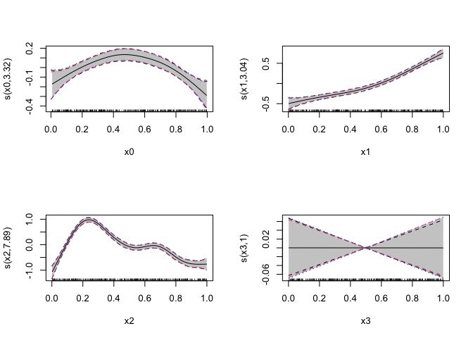
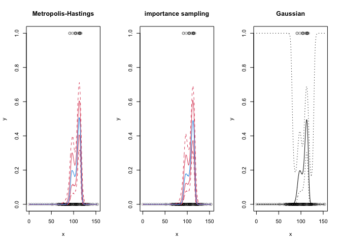

GAM posterior sampling
======================

This repo has some example code for posterior sampling from GAMs as
fitted by `mgcv`.

Thanks to Simon Wood, Eric Pedersen and Len Thomas for their
contributions and assistance with various parts of this.

Background
----------

We can sample from the posterior of our model to get various useful
quantities. The general algorithm consists of

1.  Sample the GAM parameters from MVN(`coef(model)`, `vcov(model)`)
2.  Calculate posterior estimates from some prediction grid (usually
    using the `predict(model, newdata, type="lpmatrix")` approach and
    multiplying this by the sample parameters generated in 1.)
3.  Generate and store some set of summary statistics.

Some papers that do this:

-   Augustin, N. H., Musio, M., von Wilpert, K., Kublin, E., Wood, S.
    N., & Schumacher, M. (2009). Modeling Spatiotemporal Forest Health
    Monitoring Data. Journal of the American Statistical Association,
    104(487), 899–911.
    <a href="https://doi.org/10.1198/jasa.2009.ap07058" class="uri">https://doi.org/10.1198/jasa.2009.ap07058</a>
-   Marra, G., Miller, D. L., & Zanin, L. (2012). Modelling the
    spatiotemporal distribution of the incidence of resident foreign
    population: Spatiotemporal Smoothing of Resident Foreign Population.
    Statistica Neerlandica, 66(2), 133–160.
    <a href="https://doi.org/10.1111/j.1467-9574.2011.00500.x" class="uri">https://doi.org/10.1111/j.1467-9574.2011.00500.x</a>
-   Augustin, N. H., Trenkel, V. M., Wood, S. N., & Lorance, P. (2013).
    Space-time modelling of blue ling for fisheries stock management:
    Space-time modelling of blue ling. Environmetrics, 24(2), 109–119.
    <a href="https://doi.org/10.1002/env.2196" class="uri">https://doi.org/10.1002/env.2196</a>

However, this can go wrong when our assumption of multivariate normality
doesn’t hold.

Two strategies have been suggested to get around this:

1.  Importance sampling (suggested in various ADMB/TMB documentation
    files).
2.  Metropolis-Hastings (built into `mgcv` in `gam.mh`)

Note that there is a bug in `mgcv::gam.mh`, spotted by Len Thomas. A
patched version is included here until a fix is in `mgcv`.

Example
-------

This is based on `gam.mh` example with a [fix from Eric
Pedersen](https://gist.github.com/eric-pedersen/69181a972de93db3657489c9d356f01f).

    library(mgcv)
    library(Hmisc) # for weighted quantiles
    set.seed(3);n <- 400

    # included in this repo
    source("importance.R")
    # fixed gam.mh
    source("gam.mh_fix.R")
    # other parts of mcmc.r in mgcv that are not exported
    source("likelihood_tools.R")
    source("ttools.R")

### First example: simulated Tweedie model…

    dat <- gamSim(1,n=n,dist="poisson",scale=.2)

    ## Gu & Wahba 4 term additive model

    dat$y <- rTweedie(exp(dat$f),p=1.3,phi=.5) ## Tweedie response
    b <- gam(y~s(x0)+s(x1)+s(x2)+s(x3),family=tw(),
             data=dat,method="REML")

    ## simulate directly from Gaussian approximate posterior...
    br <- rmvn(1000,coef(b),vcov(b))

    ## Alternatively use MH sampling...
    br.mh <- gam.mh(b,thin=2,ns=2000,rw.scale=.15)$bs

    ##   |                                                                              |                                                                      |   0%  |                                                                              |=                                                                     |   1%  |                                                                              |=                                                                     |   2%  |                                                                              |==                                                                    |   3%  |                                                                              |===                                                                   |   4%  |                                                                              |====                                                                  |   5%  |                                                                              |====                                                                  |   6%  |                                                                              |=====                                                                 |   7%  |                                                                              |======                                                                |   8%  |                                                                              |======                                                                |   9%  |                                                                              |=======                                                               |  10%  |                                                                              |========                                                              |  11%  |                                                                              |========                                                              |  12%  |                                                                              |=========                                                             |  13%  |                                                                              |==========                                                            |  14%  |                                                                              |==========                                                            |  15%  |                                                                              |===========                                                           |  16%  |                                                                              |============                                                          |  17%  |                                                                              |=============                                                         |  18%  |                                                                              |=============                                                         |  19%  |                                                                              |==============                                                        |  20%  |                                                                              |===============                                                       |  21%  |                                                                              |===============                                                       |  22%  |                                                                              |================                                                      |  23%  |                                                                              |=================                                                     |  24%  |                                                                              |==================                                                    |  25%  |                                                                              |==================                                                    |  26%  |                                                                              |===================                                                   |  27%  |                                                                              |====================                                                  |  28%  |                                                                              |====================                                                  |  29%  |                                                                              |=====================                                                 |  30%  |                                                                              |======================                                                |  31%  |                                                                              |======================                                                |  32%  |                                                                              |=======================                                               |  33%  |                                                                              |========================                                              |  34%  |                                                                              |========================                                              |  35%  |                                                                              |=========================                                             |  36%  |                                                                              |==========================                                            |  37%  |                                                                              |===========================                                           |  38%  |                                                                              |===========================                                           |  39%  |                                                                              |============================                                          |  40%  |                                                                              |=============================                                         |  41%  |                                                                              |=============================                                         |  42%  |                                                                              |==============================                                        |  43%  |                                                                              |===============================                                       |  44%  |                                                                              |================================                                      |  45%  |                                                                              |================================                                      |  46%  |                                                                              |=================================                                     |  47%  |                                                                              |==================================                                    |  48%  |                                                                              |==================================                                    |  49%  |                                                                              |===================================                                   |  50%  |                                                                              |====================================                                  |  51%  |                                                                              |====================================                                  |  52%  |                                                                              |=====================================                                 |  53%  |                                                                              |======================================                                |  54%  |                                                                              |======================================                                |  55%  |                                                                              |=======================================                               |  56%  |                                                                              |========================================                              |  57%  |                                                                              |=========================================                             |  58%  |                                                                              |=========================================                             |  59%  |                                                                              |==========================================                            |  60%  |                                                                              |===========================================                           |  61%  |                                                                              |===========================================                           |  62%  |                                                                              |============================================                          |  63%  |                                                                              |=============================================                         |  64%  |                                                                              |==============================================                        |  65%  |                                                                              |==============================================                        |  66%  |                                                                              |===============================================                       |  67%  |                                                                              |================================================                      |  68%  |                                                                              |================================================                      |  69%  |                                                                              |=================================================                     |  70%  |                                                                              |==================================================                    |  71%  |                                                                              |==================================================                    |  72%  |                                                                              |===================================================                   |  73%  |                                                                              |====================================================                  |  74%  |                                                                              |====================================================                  |  75%  |                                                                              |=====================================================                 |  76%  |                                                                              |======================================================                |  77%  |                                                                              |=======================================================               |  78%  |                                                                              |=======================================================               |  79%  |                                                                              |========================================================              |  80%  |                                                                              |=========================================================             |  81%  |                                                                              |=========================================================             |  82%  |                                                                              |==========================================================            |  83%  |                                                                              |===========================================================           |  84%  |                                                                              |============================================================          |  85%  |                                                                              |============================================================          |  86%  |                                                                              |=============================================================         |  87%  |                                                                              |==============================================================        |  88%  |                                                                              |==============================================================        |  89%  |                                                                              |===============================================================       |  90%  |                                                                              |================================================================      |  91%  |                                                                              |================================================================      |  92%  |                                                                              |=================================================================     |  93%  |                                                                              |==================================================================    |  94%  |                                                                              |==================================================================    |  95%  |                                                                              |===================================================================   |  96%  |                                                                              |====================================================================  |  97%  |                                                                              |===================================================================== |  98%  |                                                                              |===================================================================== |  99%  |                                                                              |======================================================================| 100%
    ## fixed acceptance =  0.794   RW acceptance =  0.2285

    ## If 'coda' installed, can check effective sample size
    ## require(coda);effectiveSize(as.mcmc(br))

    ## Alternatively use importance sampling...
    br.imp <- gam.imp(b, ns=1000)

    ## Now compare simulation results and Gaussian approximation for
    ## smooth term confidence intervals...
    x <- seq(0,1,length=100)
    pd <- data.frame(x0=x,x1=x,x2=x,x3=x)
    X <- predict(b,newdata=pd,type="lpmatrix")

    # black is MVN, blue is MH, red is importance in this plot
    # good agreement
    par(mfrow=c(2,2))
    for(i in 1:4) {
      plot(b,select=i,scale=0,scheme=1)
      ii <- b$smooth[[i]]$first.para:b$smooth[[i]]$last.para

      # MVN
      ff <- X[,ii]%*%t(br[,ii])
      fq <- apply(ff,1,quantile,probs=c(.025,.975))
      lines(x, fq[1, ], lty=2);lines(x, fq[2, ], lty=2)

      # M-H
      ff <- X[,ii]%*%t(br.mh[,ii])
      fq <- apply(ff,1,quantile,probs=c(.025,.975))
      lines(x, fq[1, ], lty=3, col="blue");lines(x, fq[2, ], lty=3, col="blue")

      # importance sample
      ff <- X[,ii]%*%t(br.imp$bs[,ii])
      fq <- apply(ff,1,wtd.quantile,probs=c(.025,.975), weights=br.imp$wts)
      lines(x,fq[1,],col=2,lty=2);lines(x,fq[2,],col=2,lty=2)

    }

### Second example, where Gaussian approximation is a failure…

    y <- c(rep(0, 89), 1, 0, 1, 0, 0, 1, rep(0, 13), 1, 0, 0, 1, 
           rep(0, 10), 1, 0, 0, 1, 1, 0, 1, rep(0,4), 1, rep(0,3),  
           1, rep(0, 3), 1, rep(0, 10), 1, rep(0, 4), 1, 0, 1, 0, 0, 
           rep(1, 4), 0, rep(1, 5), rep(0, 4), 1, 1, rep(0, 46))
    set.seed(3);x <- sort(c(0:10*5,rnorm(length(y)-11)*20+100))

    b <- gam(y ~ s(x, k = 15),method = 'REML', family = binomial)
    br <- gam.mh(b,thin=2,ns=2000,rw.scale=.4)$bs

    ##   |                                                                              |                                                                      |   0%  |                                                                              |=                                                                     |   1%  |                                                                              |=                                                                     |   2%  |                                                                              |==                                                                    |   3%  |                                                                              |===                                                                   |   4%  |                                                                              |====                                                                  |   5%  |                                                                              |====                                                                  |   6%  |                                                                              |=====                                                                 |   7%  |                                                                              |======                                                                |   8%  |                                                                              |======                                                                |   9%  |                                                                              |=======                                                               |  10%  |                                                                              |========                                                              |  11%  |                                                                              |========                                                              |  12%  |                                                                              |=========                                                             |  13%  |                                                                              |==========                                                            |  14%  |                                                                              |==========                                                            |  15%  |                                                                              |===========                                                           |  16%  |                                                                              |============                                                          |  17%  |                                                                              |=============                                                         |  18%  |                                                                              |=============                                                         |  19%  |                                                                              |==============                                                        |  20%  |                                                                              |===============                                                       |  21%  |                                                                              |===============                                                       |  22%  |                                                                              |================                                                      |  23%  |                                                                              |=================                                                     |  24%  |                                                                              |==================                                                    |  25%  |                                                                              |==================                                                    |  26%  |                                                                              |===================                                                   |  27%  |                                                                              |====================                                                  |  28%  |                                                                              |====================                                                  |  29%  |                                                                              |=====================                                                 |  30%  |                                                                              |======================                                                |  31%  |                                                                              |======================                                                |  32%  |                                                                              |=======================                                               |  33%  |                                                                              |========================                                              |  34%  |                                                                              |========================                                              |  35%  |                                                                              |=========================                                             |  36%  |                                                                              |==========================                                            |  37%  |                                                                              |===========================                                           |  38%  |                                                                              |===========================                                           |  39%  |                                                                              |============================                                          |  40%  |                                                                              |=============================                                         |  41%  |                                                                              |=============================                                         |  42%  |                                                                              |==============================                                        |  43%  |                                                                              |===============================                                       |  44%  |                                                                              |================================                                      |  45%  |                                                                              |================================                                      |  46%  |                                                                              |=================================                                     |  47%  |                                                                              |==================================                                    |  48%  |                                                                              |==================================                                    |  49%  |                                                                              |===================================                                   |  50%  |                                                                              |====================================                                  |  51%  |                                                                              |====================================                                  |  52%  |                                                                              |=====================================                                 |  53%  |                                                                              |======================================                                |  54%  |                                                                              |======================================                                |  55%  |                                                                              |=======================================                               |  56%  |                                                                              |========================================                              |  57%  |                                                                              |=========================================                             |  58%  |                                                                              |=========================================                             |  59%  |                                                                              |==========================================                            |  60%  |                                                                              |===========================================                           |  61%  |                                                                              |===========================================                           |  62%  |                                                                              |============================================                          |  63%  |                                                                              |=============================================                         |  64%  |                                                                              |==============================================                        |  65%  |                                                                              |==============================================                        |  66%  |                                                                              |===============================================                       |  67%  |                                                                              |================================================                      |  68%  |                                                                              |================================================                      |  69%  |                                                                              |=================================================                     |  70%  |                                                                              |==================================================                    |  71%  |                                                                              |==================================================                    |  72%  |                                                                              |===================================================                   |  73%  |                                                                              |====================================================                  |  74%  |                                                                              |====================================================                  |  75%  |                                                                              |=====================================================                 |  76%  |                                                                              |======================================================                |  77%  |                                                                              |=======================================================               |  78%  |                                                                              |=======================================================               |  79%  |                                                                              |========================================================              |  80%  |                                                                              |=========================================================             |  81%  |                                                                              |=========================================================             |  82%  |                                                                              |==========================================================            |  83%  |                                                                              |===========================================================           |  84%  |                                                                              |============================================================          |  85%  |                                                                              |============================================================          |  86%  |                                                                              |=============================================================         |  87%  |                                                                              |==============================================================        |  88%  |                                                                              |==============================================================        |  89%  |                                                                              |===============================================================       |  90%  |                                                                              |================================================================      |  91%  |                                                                              |================================================================      |  92%  |                                                                              |=================================================================     |  93%  |                                                                              |==================================================================    |  94%  |                                                                              |==================================================================    |  95%  |                                                                              |===================================================================   |  96%  |                                                                              |====================================================================  |  97%  |                                                                              |===================================================================== |  98%  |                                                                              |===================================================================== |  99%  |                                                                              |======================================================================| 100%
    ## fixed acceptance =  0.2635   RW acceptance =  0.2215

    br.imp <- gam.imp(b,ns=2000)
    X <- model.matrix(b)

    par(mfrow=c(1,3))
    plot(x, y, col = rgb(0,0,0,0.25), ylim = c(0,1), main="Metropolis-Hastings")
    ff <- X%*%t(br)
    linv <- b$family$linkinv

    ## Get intervals for the curve on the response scale...
    fq <- linv(apply(ff,1,quantile,probs=c(.025,.16,.5,.84,.975)))
    lines(x,fq[1,],col=2,lty=2)
    lines(x,fq[5,],col=2,lty=2)
    lines(x,fq[2,],col=2)
    lines(x,fq[4,],col=2)
    lines(x,fq[3,],col=4)

    ## importance sample
    plot(x, y, col = rgb(0,0,0,0.25), ylim = c(0,1), main="importance sampling")
    ff <- X%*%t(br.imp$bs)

    ## Get intervals for the curve on the response scale...
    fq <- linv(apply(ff,1,wtd.quantile,probs=c(.025,.16,.5,.84,.975),
                     weights=br.imp$wts))
    lines(x,fq[1,],col=2,lty=2)
    lines(x,fq[5,],col=2,lty=2)
    lines(x,fq[2,],col=2)
    lines(x,fq[4,],col=2)
    lines(x,fq[3,],col=4)

    ## Compare to the Gaussian posterior approximation
    plot(x, y, col = rgb(0,0,0,0.25), ylim = c(0,1), main="Gaussian")
    fv <- predict(b,se=TRUE)
    lines(x,linv(fv$fit))
    lines(x,linv(fv$fit-2*fv$se.fit),lty=3)
    lines(x,linv(fv$fit+2*fv$se.fit),lty=3)

    ## ... Notice the useless 95% CI (black dotted) based on the
    ## Gaussian approximation!
